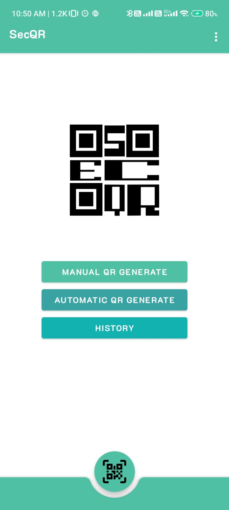
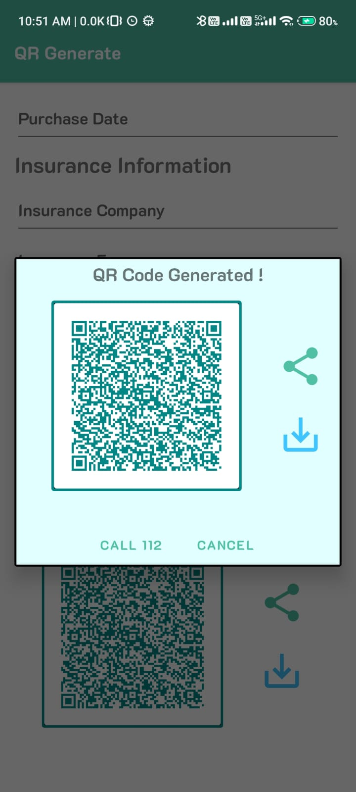
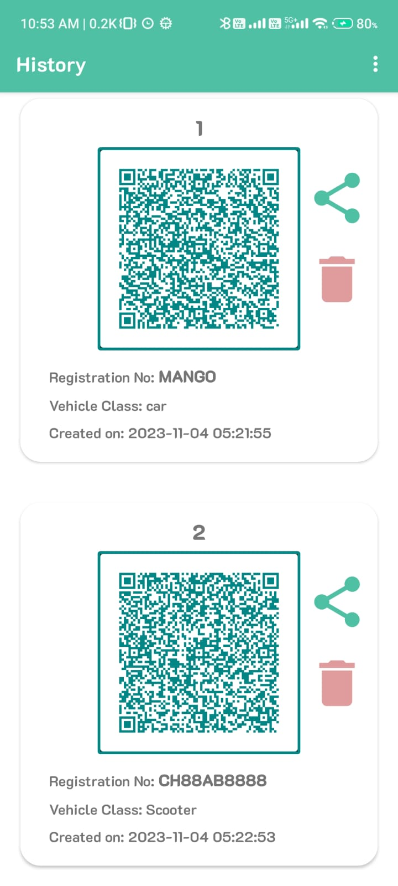
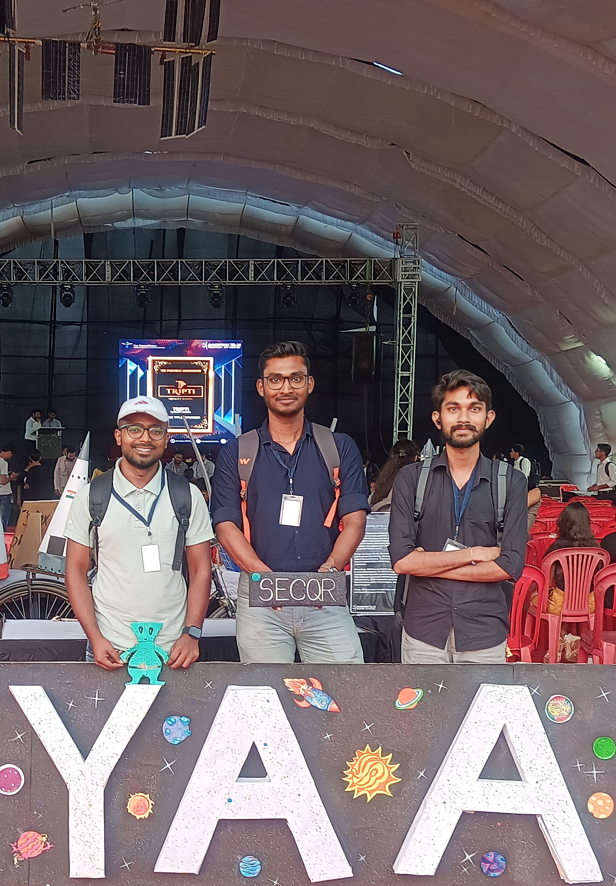

# SecQR - Custom QR Code Generator

SecQR is an Android app developed by Vivek, Aashutosh, and Deepanshu. This app empowers users to generate custom QR codes for vehicles, and the data within these QR codes can be interpreted at different stakeholder levels. SecQR enables offline functionality, allowing you to create and scan QR codes even without an internet connection.

## Contents

- [Key Features](#key-features)
- [Screenshots](#screenshots)
- [Meet the Team](#meet-the-team)
- [Connect with Us](#connect-with-us)

## Key Features

- **Custom QR Code Generation:** Create unique QR codes for vehicles with customizable data.
- **Stakeholder Levels:** Tailored data presentation for three distinct stakeholder levels.
- **Offline Functionality:** Setup levels online, but operate offline for QR code generation and scanning.

## Screenshots

## Meet the Team

### Vivek

- LinkedIn: [Vivek's LinkedIn Profile](https://www.linkedin.com/in/NITRR-Vivek)

### Aashutosh
- LinkedIn: [Aashutosh's LinkedIn Profile](https://www.linkedin.com/in/aashutosh-patel)

### Deepanshu
- LinkedIn: [Deepanshu's LinkedIn Profile](https://www.linkedin.com/in/deepanshu-patel-3b55a0228)

---
